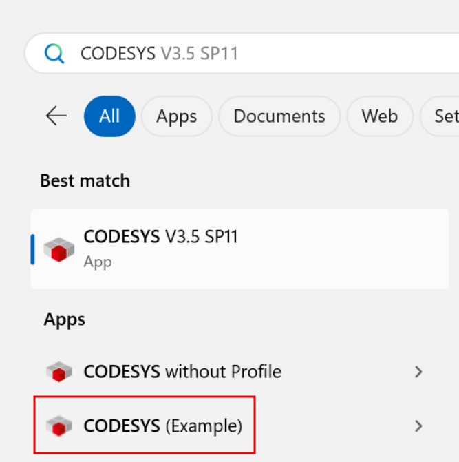

# CODEPLEX

_/koh-DEH-pleks/_

Duplicate your CODESYS installations.

CODEPLEX provides a script to duplicate an existing CODESYS installation. The duplicated installation will have separate:

- devices
- libraries
- package manager

This is useful for working across multiple different projects that require different versions of CODESYS libraries.

CODEPLEX also optionally creates start menu entries and desktop shortcuts for the duplicated installation.

## Usage
CODEPLEX requires Python 3 to be installed on your system (https://www.python.org/downloads/).

To run, clone the repo and run run `codeplex.bat` as administrator. This will in turn run `codeplex.py`.

## Status

CODESCRIBE has been tested only on CODESYS V3.5 SP11.
